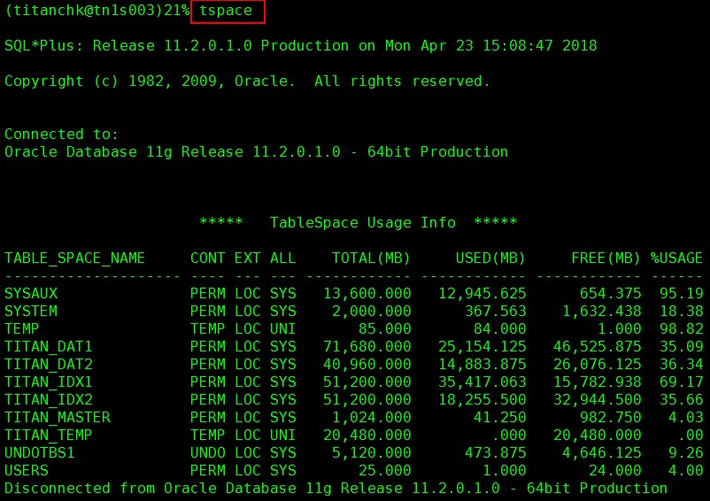
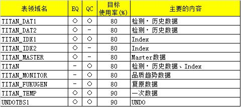

# 表空间使用率的确认

数据库分布如图：

|Server|DB|
|---|---|
|EQ1|无|
|EQ2|无|
|EQ3|有|
|EQ4|有|
|QC1|有|
|QC2|有|
|DEV|有|

但是点检 EQ3、EQ4 的数据库时，需要在 EQ1、EQ2 上执行。

> 在 EQ3、EQ4 也是有办法执行命令的，只是没加入环境变量而已。

---

需对应以下情况:

- 表空间使用率突然增加(1%/日以上)
- 表领域的使用率处理危险状态

判定为危险状态的标准，请参照下表内容：

