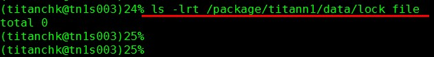
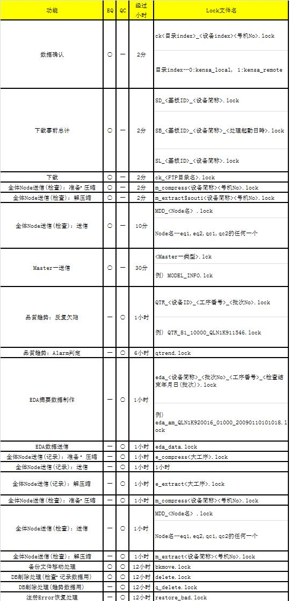

# Lock文件残留情况确认

该命令用来确认 TITAN 运行时主要进程中创建的 Lock 文件的残留情况。

Lock 文件是用于防止重复启动进程的文件，该文件一直存在于 TITAN 各进程运行时。该文件本应当随进程结束而自动被删除，但当 TITAN 中出现任何异常时，将在程序中仅保留 Lock 文件。

一旦出现Lock文件剩余的情形，将意味着该功能一直处于停止状态，必须手动消除

未发现Lock文件时（正常情况），将显示「total 0」信息。

出现 Lock 文件时，会显示Lock文件名和文件创建时间。

通过确认 Lock 文件的保留时间从而判断是否将其看成文件残留状态。在目标 nod e中，通过执行 date 命令从而确认当前时间。

因功能不同，各进程的运行时间也不一致。因此，作为残留状态判定的时间段也因各功能中的 Lock 文件名不同而有所变化。

## 对照表

在找到的 Lock 文件中，根据以下列表要求进行确认（超过对应表中经过时间并且还能找到 Lock 文件时，将该 Lock 文件判定为残留状态）：

