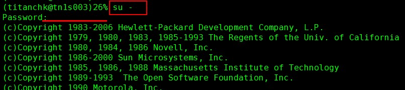
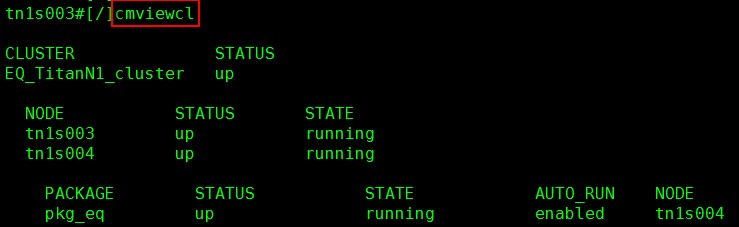

# 系统群集运行状态

此命令需要在 root 用户下操作，**务必要谨慎执行！**

> 如果不记得密码了，请直接问我。

1. 切换 root

	

2. 输入命令

	

---
	
- CLUSTER：当前群集名字
- STATUS：当前群集运行状态，up 为正常运行，down 状态则表明群集已停止。
- NODE、STATUS、STATE：当前群集的构成节点名及其状态，up&running为正常，其他的为异常。
- PACKAGE、STATUS、STATE、AUTO_RUN、NODE：群集中的程序包的运行状态，up&running 为正常，NODE 一栏显示的是当前程序包的运行节点，如果发现运行节点已发生切换，则说明系统发生 failover。
